# WhoOwesWho

## Overview

WhoOwesWho is a small app for splitting shared expenses between multiple people in a group.
It lets you create groups, add members, and record payments made by any member.
After payments are entered, the app helps you understand who owes whom based on the recorded spending.
You can review group details to see the current state of the group and the list of payments.
Members can be added as a group grows, and payments can be added as new expenses occur.
The UI includes confirmation flows for removing a group, a member, or a payment to reduce accidental changes.
Authentication screens are present to support sign-in/sign-up and a controlled sign-out flow.

<strong>Screenshots</strong>

### Sign up

Sign-up screen for creating a new user account.

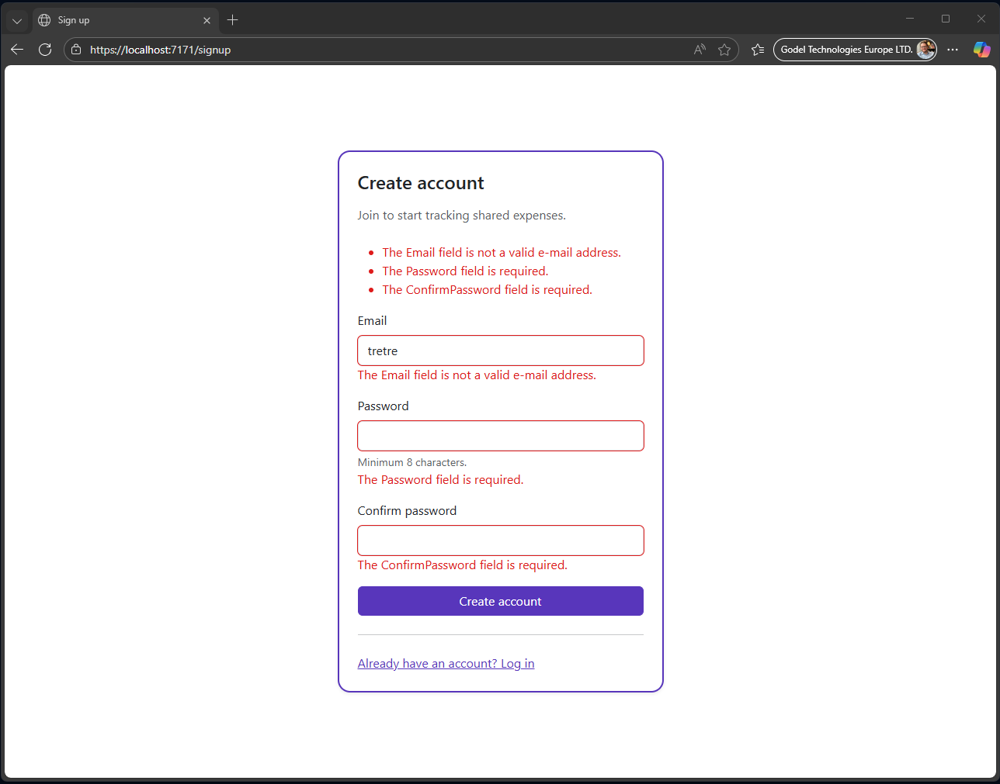

### Login

Login screen for accessing the app.

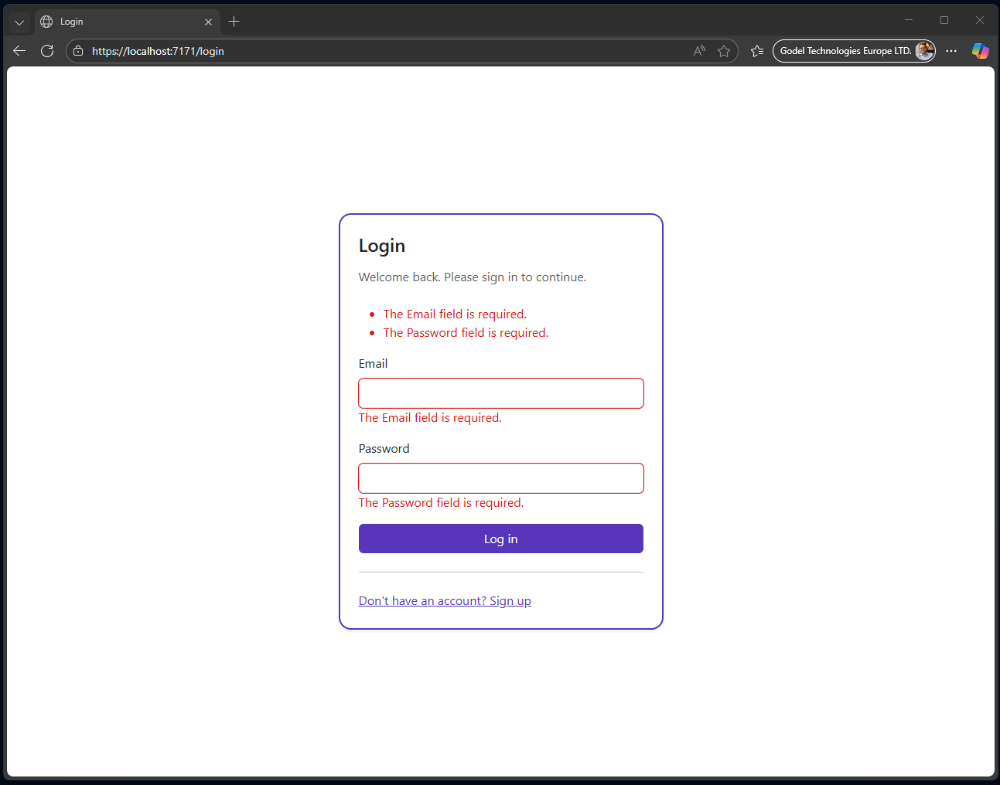

### Home

Landing page of the UI.

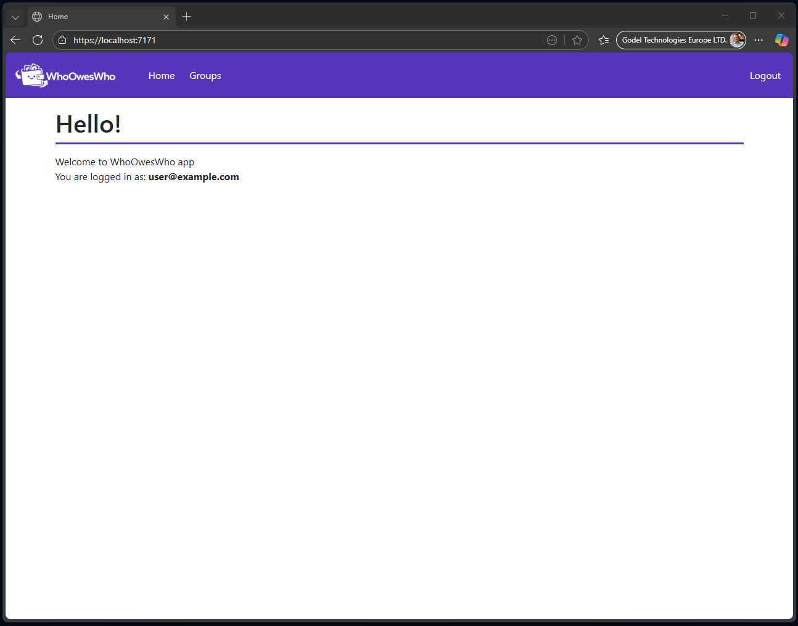

### Groups

List of existing groups and entry point to create a new one.

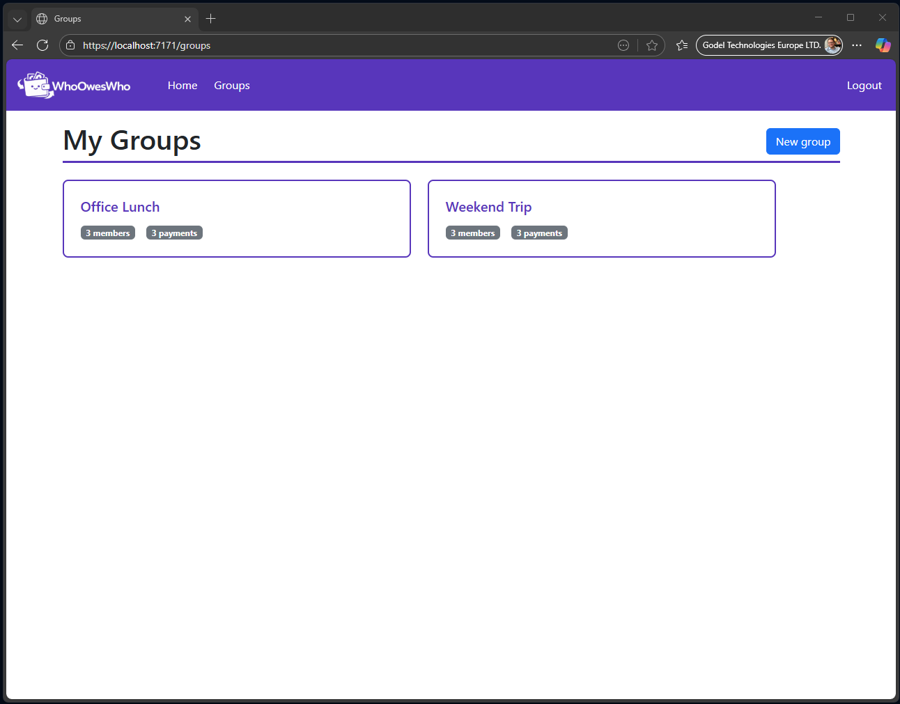

### Create new group

Form for creating a new group.

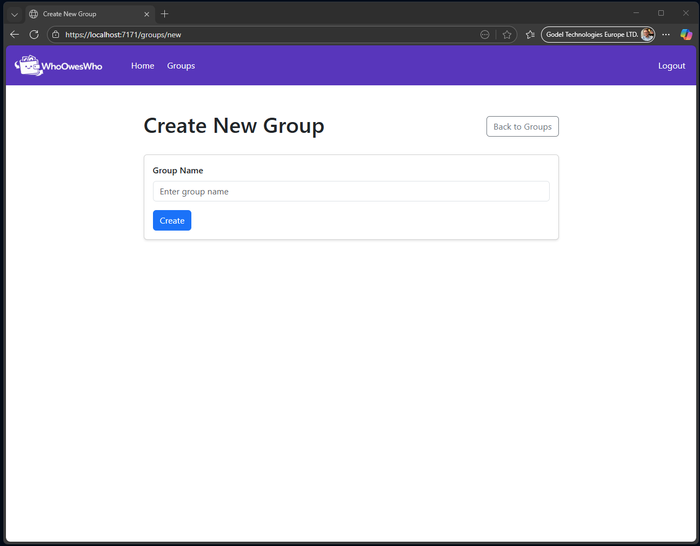

### Group details

Group overview showing members and recorded payments.

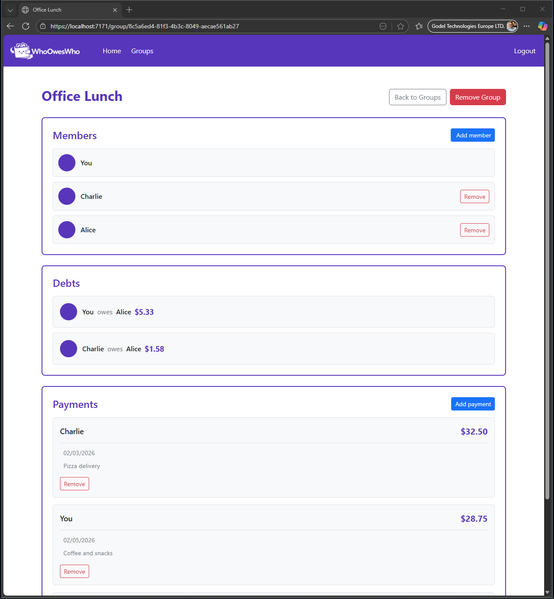

### Add member

Page for adding a new member to a group.

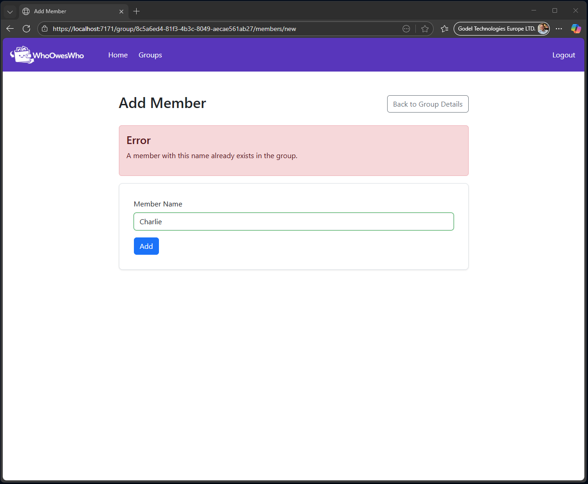

### Add payment

Page for recording a new payment/expense in a group.

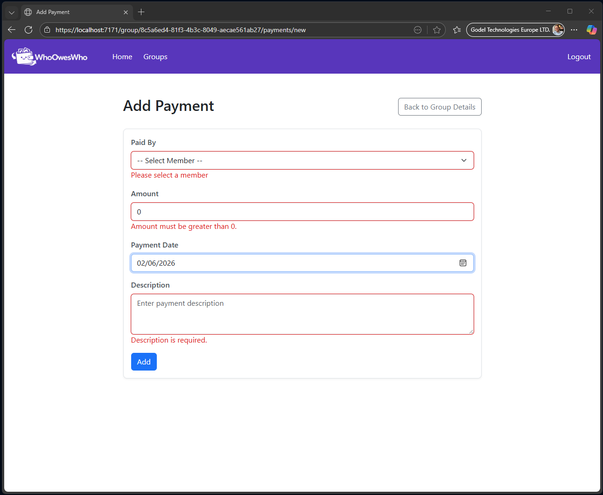

### Remove member confirmation

Confirmation screen shown before removing a member.

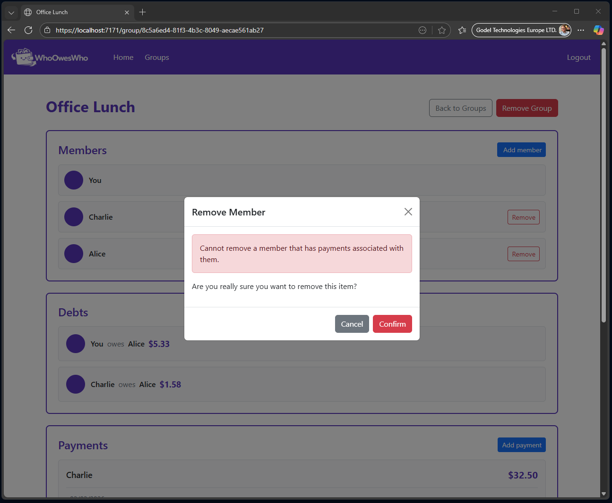

### Remove payment confirmation

Confirmation screen shown before removing a payment.

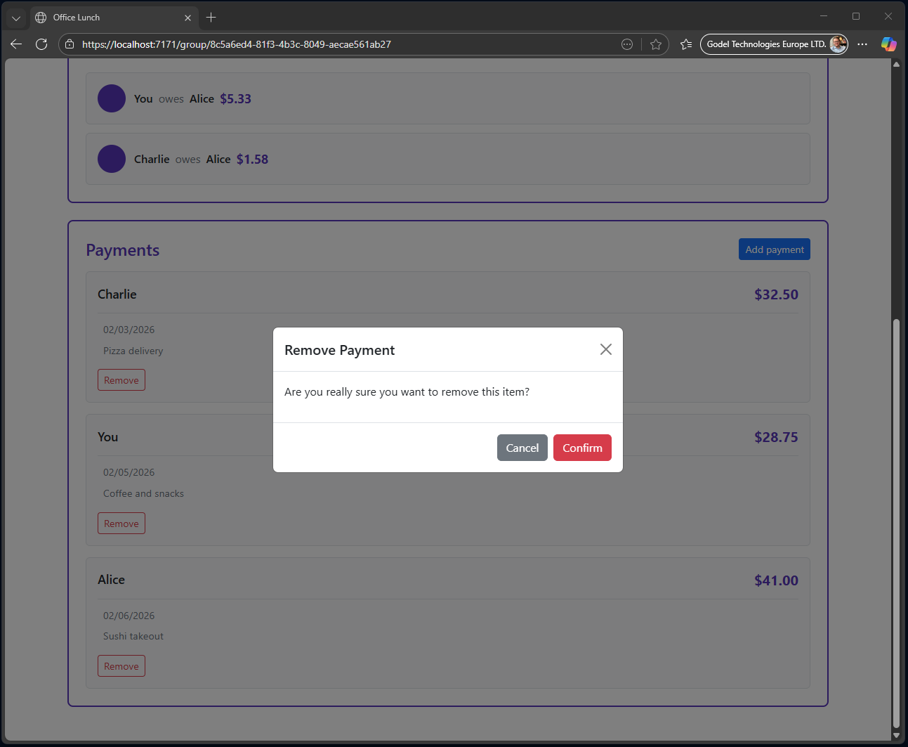

### Remove group confirmation

Confirmation screen shown before removing an entire group.

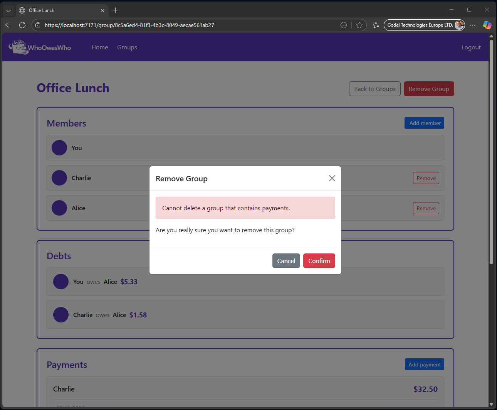

### Logout confirmation

Confirmation screen shown before signing out.

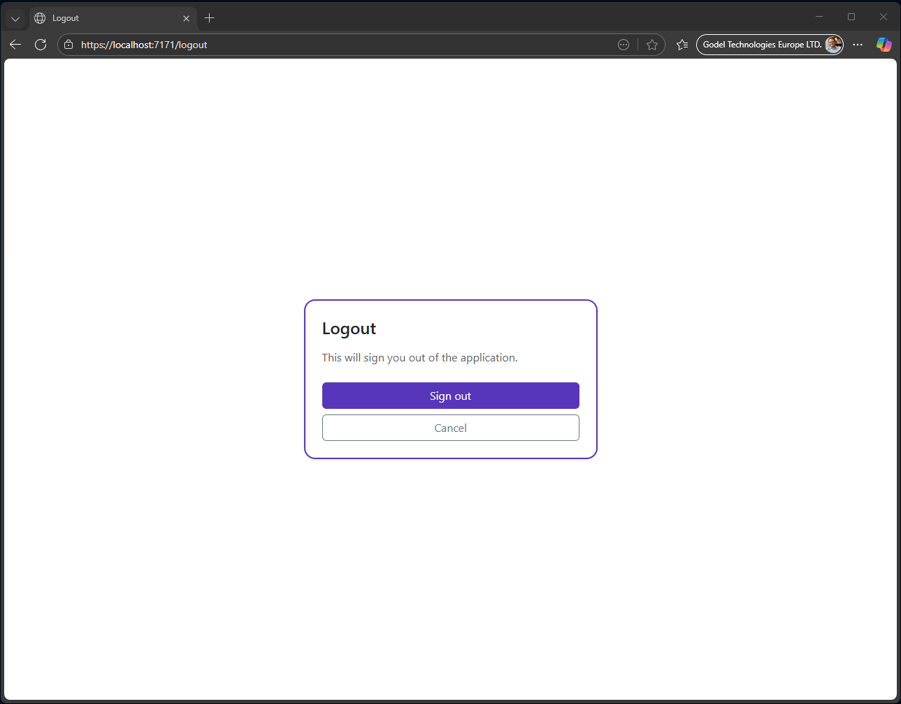

## Technical notes

- Backend: ASP.NET Core Web API (.NET 10), controllers + OpenAPI in Development.
- Frontend: Blazor Server (.NET 10) using Razor Components (interactive server render mode) and Bootstrap 5.3.
- Tests: separate test projects for API and UI under `Tests/`.

This project was created with heavy AI assistance (more than 90% of the code/content was generated with AI), while the programmer focused primarily on prompting, reviewing, debugging, and verifying the results.

## Tools, models

Editors/IDEs:

- VS Code
- Visual Studio 2026

AI models (picked depending on task complexity and whether it was backend or frontend work):

- ChatGPT 5.2
- ChatGPT Codex 5.1
- Claude Sonnet 4.5
- ChatGPT 4.1

## Prompts

<strong>Prompts</strong>

<strong>Implement a simple JWT-based authentication API</strong>

You are a senior .NET software engineer and solution architect.

Task:
Implement a simple JWT-based authentication API.

Requirements:

- Use ASP.NET Core Web API
- Implement authentication using JWT
- Provide API endpoints for:
  - User sign-up
  - User login
- Use a controller-based approach
- Apply the repository pattern for data access
- Use services to implement business logic
- Controllers should call service methods only
- Use dependency injection throughout the application
- Use DTOs for request and response models
- Request and response DTOs must be placed in the existing class library:
  WhoOwesWho.Common (shared with other applications)
- Store data in memory (no database)

Guidelines:

- Follow Clean Architecture and best practices where applicable
- Keep controllers thin and free of business logic
- Prefer clarity and maintainability over cleverness

Behavior:

- If requirements are unclear, ask clarifying questions before proposing a solution
- If requirements contradict best practices, explain the risks,
propose a better solution, and ask for confirmation before proceeding

<strong>Generate a logo</strong>

Generate a logo:

- Logo should be for application which helps to split expenses with the name WhoOwenWho
- as I will have purple header can colors be ok for using it for purple background

<strong>Layouts creation</strong>

You are a senior .NET software engineer with strong front-end expertise

Task

- Implement UI support using Bootstrap 5.3 via CDN
- Create MainLayout component with a responsive header
- Logo on the left (images/logo.png)
- Navigation menu after the logo with reasonable spacing
- Logout item (link to home page for now)
- Header background color: modern purple color
- Responsive Behavior
- Desktop: menu displayed horizontally in header
- Mobile: burger button appears
- Pressing burger button shows menu as vertical list

Constraints

- Use Bootstrap 5.3 components and utilities where possible
- Do not include authentication logic yet

Behavior

- If any requirement is unclear, ask clarifying questions before proposing a solution

<strong>Screenshots</strong>

Title: Implement Login, Signup, and Logout UI

Description:
Create the login and signup pages for the application, implementing full UI functionality using the existing endpoints. Ensure the pages are responsive and include proper input validation.

Acceptance Criteria / Tasks:

1. Login and Signup Pages

- Create separate pages for login and signup.
- These pages should not use the main layout — no header or menu should be shown.
- Forms must be centered in the viewport.

2. Forms

- Include all fields required for login and signup.
- Add server input validation (e.g., required fields, valid email format, password rules).
- Submit buttons must use the purple color from the main layout header.
- Forms should have rounded borders in the same purple color.

3. Functionality

- Don't implement integration with with Auth API, it will be created later
- Leave submit form handlers empty

4. Responsiveness

- Markup should be fully responsive and adapted to mobile view.

5. Design/Style Notes:

- Ensure clean, accessible markup.

<strong>Cookie-based authentication</strong>

Implement cookie-based authentication

Requirements:

- Store received from LoginAsync() JWT securely per user (Blazor Server safe approach) for later API calls
- Use cookie authentication in the UI app for route protection and navigation ([Authorize], <AuthorizeView>)
- Don't add token to any endpoints for not, it's for futher implementation
- Provide necessary service registrations and minimal working code.
- No global state management is required, do not add a custom AuthenticationStateProvider.
- Do not add token refresh, auto-logout, or any complex session management.
- Follow clean code practices and basic error handling, without overengineering.

<strong>REST API for a split-expenses</strong>

You are a senior backend engineer.

Build a REST API for a split-expenses

TECH STACK & ARCHITECTURE

- Controller-based API
- Repository pattern for data access
- Service layer for business logic
- Controllers must call services only
- Dependency Injection everywhere
- In-memory storage only (no database)
- Use DTOs for all requests and responses
- DTOs must be placed in the existing class library:
  WhoOwesWho.Common

AUTHENTICATION & AUTHORIZATION

- All endpoints must be protected with [Authorize]
- Use Bearer Token authentication
- Creator User Id must be extracted from the bearer token
- Authenticated user:
  - Must be automatically added as a group member on group creation
  - Has reserved member name "You"
  - Cannot be removed from the group

DOMAIN MODELS

Group:

- Guid Id
- Guid CreatorUserId
- string Title
- List<Member> Members
- List<Payment> Payments

Member:

- Guid Id
- string Name

Rules:

- Member name "You" is reserved and cannot be added manually
- A member cannot be removed if they have any payments

Payment:

- Guid Id
- Guid MemberId (who paid)
- string MemberName
- DateTime PaymentDate
- string Description

BUSINESS RULES

- Each group must contain members
- Authenticated user is a required member
- Authenticated user cannot be removed
- A group cannot be deleted if it contains any payments
- A member cannot be removed if payments exist for that member
- A payment must reference an existing group member

REQUIRED ENDPOINTS

- Create Group
- Remove Group
- Add Member to Group
- Remove Member from Group
- Add Payment to Group
- Remove Payment from Group

DTO REQUIREMENTS

- Use separate request and response DTOs
- Do not expose domain models directly
- Place all DTOs in WhoOwesWho.Common

IMPLEMENTATION EXPECTATIONS

- Clean separation of concerns
- Services contain business logic
- Repositories manage in-memory data
- Proper validation and error handling

Before implementation, ask any necessary clarification questions.

<strong>Integration with Groups API</strong>

You are a senior frontend engineer.

Build a UI feature that integrates with an existing Groups API.

SCOPE

- Implement integration with Groups API
- Only 1 endpoint is needed for now:
  - Get all groups for the authenticated user

PAGE REQUIREMENTS

- Create a page that displays all user groups
- The page fetches groups on load
- Display groups as a list of cards

COMPONENTS

Group Component:

- Implement a reusable Group component
- The Group component must be a separate component
- Displayed as a card
- Rounded border
- border color: standart --wow-primary
- Title displayed as the group name

LAYOUT & RESPONSIVENESS

- Groups list layout:
  - Display cards in a row
  - Automatically wrap to a new row if there is not enough horizontal space
- Card sizing:
  - Minimum width: 300px
  - Maximum width: 500px
- Desktop / tablet view:
  - Cards displayed in rows (grid or flex with wrap)
- Mobile view:
  - For screen width less than 768px
  - Cards must be displayed vertically (one per row)

IMPLEMENTATION EXPECTATIONS

- Clean and readable code
- Clear separation of components
- Proper API error and loading handling
- Responsive CSS (Flexbox or Grid)

Before implementation, ask any necessary clarification questions.

<strong>Group Details page</strong>

You are a senior frontend engineer.

Build a new UI feature: Group Details page.

SCOPE

- Implement integration with Groups API
- Use the endpoint: GetGroupDetails
- New page route: group/{id}
- Fetch group details on page load using the group id

PAGE REQUIREMENTS

- Create a new page: GroupDetails
- Display the following sections vertically:
  1. List of all group members
  2. List of all group payments
- Each section must be contained in a block with:
  - Rounded borders
  - Standard color: --wow-primary
- Members section displayed above payments section

COMPONENTS

- Create separate components for:
  - Member list block
  - Payments list block

LAYOUT & RESPONSIVENESS

- Display sections vertically
- Cards/blocks should be responsive
- Maintain standard spacing and padding for readability

IMPLEMENTATION EXPECTATIONS

- Clean, readable code
- Clear separation of components
- Proper API loading and error handling
- Reusable components for members and payments
- Responsive CSS (Flexbox or Grid as needed)

Before implementation, ask any necessary clarification questions.

<strong>Adding Group creation</strong>

You are a senior frontend engineer.

Extend the existing Groups UI functionality by adding Group creation.

SCOPE

- Add a "New group" feature
- Integrate with Groups API CreateGroup endpoint

GROUPS LIST PAGE CHANGES

- Page title: "My groups"
- Add a button "New group"
- Button must be aligned to the right side of the title
  (same alignment style as "Back to groups" button)
- On button click, navigate to the new page: groups/new

NEW PAGE: CREATE GROUP

- Route: groups/new
- Create a new page with a form for creating a group

FORM REQUIREMENTS

- Input field: Group Name
- Validation:
  - Required
  - Minimum length: 1 character
  - Maximum length: 20 characters
  - Validate before sending request
- Submit button: "Create"

ERROR HANDLING

- If server or validation error occurs:
  - Display a standard error message
  - Use the standard error banner component/style

SUCCESS FLOW

- If group is successfully created:
  - Receive created group id from API
  - Redirect user to: groups/{id}
  - Display the GroupDetails page

IMPLEMENTATION EXPECTATIONS

- Clean and readable code
- Client-side validation handling
- Clear separation of components
- Reuse existing layout and styles

Before implementation, ask any necessary clarification questions.

<strong>Ability to add members to a group</strong>

You are a senior frontend engineer.

Extend the Group Details functionality by adding the ability to add members to a group.

SCOPE

- Integrate with Groups API: AddMember endpoint
- Feature is available on the GroupDetails page

GROUP DETAILS PAGE CHANGES

- In the Members section:
  - Add a button "Add member"
  - Button should be aligned to the right of the Members section header
- On button click, open a new page

ADD MEMBER PAGE

- Route: groups/{id}/members/new
- Create a form for adding a new member to the group
- Create "Back to Groups" button (see implementation on NewGroup.razor page)

FORM REQUIREMENTS

- Input field: Member Name
- Validation:
  - Required
- Submit button: "Add"

ERROR HANDLING

- If validation or server error occurs:
  - Display a standard error message

SUCCESS FLOW

- If member is successfully added:
  - Redirect back to: groups/{id}
  - Updated members list must be displayed

IMPLEMENTATION EXPECTATIONS

- Clean and readable code
- Reuse existing layout and styles
- Proper loading and disabled states for submit button

Before implementation, ask any necessary clarification questions.

<strong>Ability to add payments to a group</strong>

You are a senior frontend engineer.

Extend the Group Details functionality by adding the ability to add payments to a group.

SCOPE

- Integrate with Groups API: AddPayment endpoint
- Feature is available on the GroupDetails page

GROUP DETAILS PAGE CHANGES

- In the Payments section:
  - Add a button "Add payment"
  - Button should be aligned to the right of the Payments section header

ADD PAYMENT PAGE

- Route: groups/{id}/payments/new
- Create a form for adding a payment to the group
- Create "Back to Group Details" button (see implementation on AddMember.razor page)

FORM REQUIREMENTS

- Input fields:
  - Paid By (select member from group members list)
  - Payment Date
  - Description
- Validation:
  - Paid By is required and must be an existing group member
  - Payment Date is required
  - Description is required
- Submit button: "Add"

ERROR HANDLING

- If validation or server error occurs:
  - Display a standard error message

SUCCESS FLOW

- If payment is successfully added:
  - Redirect back to: groups/{id}
  - Updated payments list must be displayed

IMPLEMENTATION EXPECTATIONS

- Clean and readable code
- Reuse existing layout and styles
- Create "Back to Groups Details" button (see implementation on NewGroup.razor page)

Before implementation, ask any necessary clarification questions.

<strong>Adding debt calculation and visualization</strong>

You are a senior full-stack engineer.

Extend the existing Groups functionality by adding debt calculation and visualization.

================================================
BACKEND – DEBTS API
================================================

SCOPE

- Add a new API endpoint to the existing GroupsController
- Endpoint returns calculated debts between group members

ARCHITECTURE & PATTERNS

- Follow the same controller / service / repository approach as existing endpoints
- Controllers must call services only
- Business logic must live in services
- Use dependency injection
- In-memory storage only
- Use DTOs for requests and responses
- DTOs must be placed in WhoOwesWho.Common

AUTHENTICATION & AUTHORIZATION

- Protect endpoint with [Authorize]
- Use Bearer Token authentication
- Authenticated user must be a group creator

ENDPOINT

- GET api/groups/{id}/debts

CORE BUSINESS LOGIC

- Each payment is made on behalf of the entire group
- Every payment is split equally among all group members
- Partial or subgroup payments are NOT supported
- Calculate:
  - TotalPaidAmount per member
  - EqualShare = TotalGroupPayments / NumberOfMembers
  - NetBalance = TotalPaidAmount − EqualShare

DEBT GENERATION RULES

- Only pairwise debts (A -> B) are allowed
- A debt means: "Member A owes Member B amount X"
- Members with NetBalance < 0 owe money
- Members with NetBalance > 0 receive money
- Match debtors to creditors until balances are settled
- Avoid circular debts
- Minimize number of debts
- Maximum debts ≤ (Members count − 1)

DEBT RESPONSE DTO
DebtResponseDto:

- Guid FromMemberId
- string FromMemberName
- Guid ToMemberId
- string ToMemberName
- decimal Amount

BUSINESS RULES

- If no payments exist, return an empty list
- Members with zero balance must not appear
- Amount must always be positive
- Use consistent rounding rules

================================================
FRONTEND – DEBTS UI
================================================

SCOPE

- Integrate with GET /groups/{id}/debts endpoint
- Display debts on the GroupDetails page

GROUP DETAILS PAGE CHANGES

- Add a new section below Members and above Payments: "Debts"
- Section must be displayed vertically after Payments
- Section container:
  - Rounded border
  - Standard color: --wow-primary

DEBTS DISPLAY

- Display list of debts in readable format:
  - "A owes B X"
- Each debt displayed as a row
- Clearly highlight:
  - Who owes
  - Who receives
  - Amount

EMPTY STATE

- If no debts exist:
  - Display message: "No debts to settle"

ERROR HANDLING

- If API call fails:
  - Display standard error banner

IMPLEMENTATION EXPECTATIONS

- Clean separation of components
- Reusable DebtList / DebtItem components
- Proper loading and error states
- Responsive layout consistent with other GroupDetails sections
- No business logic in UI (use API results only)

================================================
FINAL NOTES
================================================

- Backend and frontend must follow existing patterns and styles
- Reuse existing infrastructure and components where possible
- Do not introduce new architectural concepts unless required

Before implementation, ask any necessary clarification questions.

<strong>Adding functionality to remove group members and remove payments (UI)</strong>

You are a senior frontend engineer.

Extend the Group Details UI by adding functionality to remove group members and remove payments,
using confirmation modals.

================================================
COMMON UI REQUIREMENTS
================================================

- Use Bootstrap modal for confirmation
- Modal text:
  "Are you really sure you want to remove this item?"
- Modal actions:
  - Confirm
  - Cancel
- While request is in progress:
  - Disable Confirm button
- If server returns an error:
  - Display error message inside the modal
  - Use standard error message styling

================================================
REMOVE MEMBER FROM GROUP
================================================

SCOPE

- Integrate with Groups API: RemoveMember endpoint
- Feature available on GroupDetails page (Members section)

UI CHANGES

- For each member in the Members list:
  - Display a "Remove" button
  - Do NOT show Remove button for the authenticated user ("You")

REMOVE FLOW

1. User clicks "Remove" on a member
2. Show Bootstrap confirmation modal
3. On Confirm:
   - Call RemoveMember API
4. On success:
   - Close modal
   - Refresh group details
5. On error:
   - Keep modal open
   - Show server error message inside modal

BUSINESS RULES (UI AWARENESS)

- Rely on server validation and show returned error
- Always refresh group details after successful removal

================================================
REMOVE PAYMENT FROM GROUP
================================================

SCOPE

- Integrate with Groups API: RemovePayment endpoint
- Feature available on GroupDetails page (Payments section)

UI CHANGES

- For each payment in the Payments list:
  - Display a "Remove" button

REMOVE FLOW

1. User clicks "Remove" on a payment
2. Show Bootstrap confirmation modal
3. On Confirm:
   - Call RemovePayment API
4. On success:
   - Close modal
   - Refresh group details
5. On error:
   - Keep modal open
   - Show server error message inside modal

================================================
IMPLEMENTATION EXPECTATIONS
================================================

- Reusable confirmation modal component
- Clean separation of concerns
- Reuse existing styles and layout
- Consistent UX between member removal and payment removal

Before implementation, ask any necessary clarification questions.

<strong>Adding functionality to remove a group (UI)</strong>

You are a senior frontend engineer.

Extend the Groups UI by adding functionality to remove a group,
using a confirmation modal.

================================================
REMOVE GROUP FUNCTIONALITY
================================================

SCOPE

- Integrate with Groups API: DeleteGroup endpoint
- Feature available on:
  - GroupDetails page

================================================
UI REQUIREMENTS
================================================

REMOVE BUTTON

- Display a "Remove group" button
- Button placement:
  - On GroupDetails page on the right side of Back to groups button
  - Aligned similarly to other navigation/actions (e.g. "Back to groups")
- Button should be visually distinct (destructive action)

CONFIRMATION MODAL

- Use Bootstrap modal
- Modal text:
  "Are you really sure you want to remove this group?"
- Modal actions:
  - Confirm
  - Cancel
- Disable Confirm button while request is in progress
- Use Reusable confirmation modal component ConfirmationModal

================================================
REMOVE FLOW
================================================

1. User clicks "Remove group"
2. Show confirmation modal
3. On Confirm:
   - Call RemoveGroup API
4. On success:
   - Close modal
   - Redirect user to: groups
5. On error:
   - Keep modal open
   - Display server error message inside modal
   - Use standard error message styling

================================================
BUSINESS RULES (UI AWARENESS)
================================================

- Do not implement client-side assumptions
- Always rely on server validation
- Display server error message returned by API

================================================
IMPLEMENTATION EXPECTATIONS
================================================

- Clean separation of components
- Proper loading, disabled, and error states
- Reuse existing styles and layout
- Consistent UX with member and payment removal

Before implementation, ask any necessary clarification questions.

<strong>Unit tests for UI: Login and Signup pages</strong>

- Cover Login and Signup pages by unit tests.
- Use BUnit, Use Fluent assertation, moq
- Tests should live in WhoOwesWho.UI.Tests project.
Before implementation, ask any necessary clarification questions.

<strong>Unit tests for backend: GroupService</strong>

•	Cover GroupService by unit tests.
•	Use Fluent assertation, moq
•	Tests should live in WhoOwesWho.Api.Tests project. Before implementation, ask any necessary clarification questions.

## Insights

1. Starting a brand-new project is more challenging than working in an existing codebase. With limited context, you need to provide more detail in the prompt and express your intent clearly to get the result you actually want.
2. Adding the line "Before implementation, ask any necessary clarification questions." is very helpful: it reduces missed requirements and saves time because the AI won’t assume defaults.
3. It’s worth refreshing/updating the agent instructions whenever you add new libraries, change your approach, or introduce new projects—more context consistently improves the outcome.
4. For me, Copilot works best on backend tasks and often produces comprehensive results with minimal follow-up.
5. For Blazor, it often makes small mistakes (e.g., missing `using`s, forgetting form `Name`s, etc.), so the code needs more careful review.
6. Copilot tends to be most reliable for common topics (API creation, Clean Architecture suggestions) and less reliable for more specific areas (authentication, Blazor UI ↔ API integration).
7. There’s no real reason to use a 1.x model for “simple” operations just to save money.

